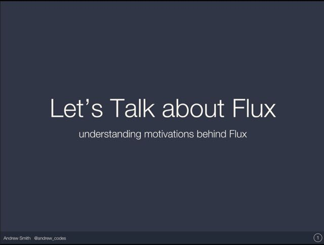

[Download the slides](http://jas.link/lets-talk-flux) for my talk presented at ConnectJS 2015. Hope you enjoy! As always, feel free to contact me for any questions or to just chat about React and/or Flux. Finally, I am looking to cultivate mentor/student relationships. With that said, there is an open invitation from me to pair program, chat and generally share experiences on programming. Tweet me on [Twitter](https://twitter.com/andrew_codes) or leave a comment.

