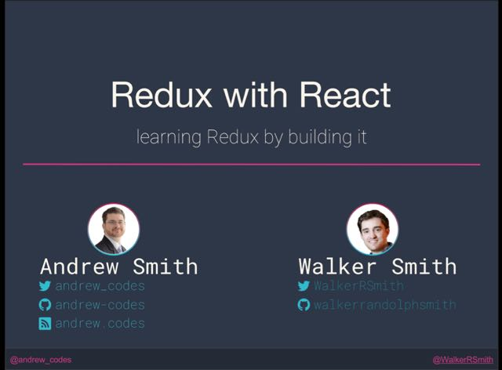

A day-long workshop provided at Connect.Tech on Redux. The workshop attempts to understand Redux better, how and why it works by building it step by step. The activities cover building redux, implementing its middleware mechanism, and `react-redux` —accompanying exercises on this GitHub [repo](https://jas.link/building-redux-connecttech-2017-repo).

